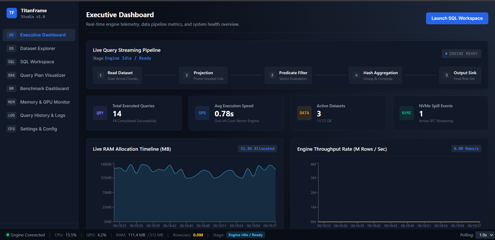
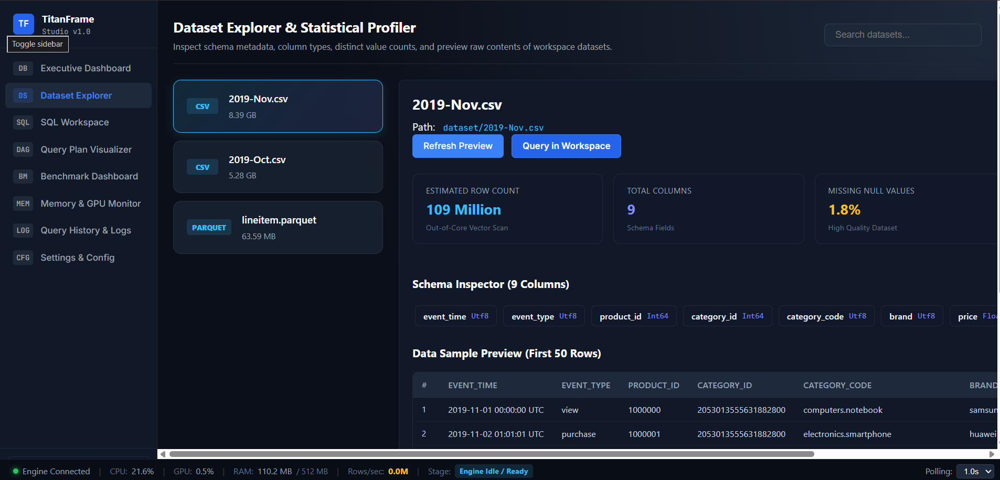
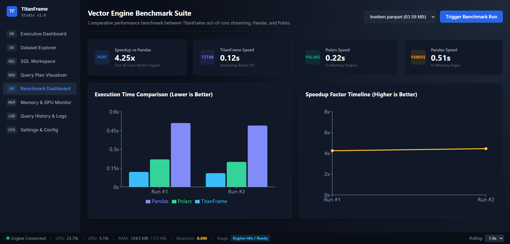
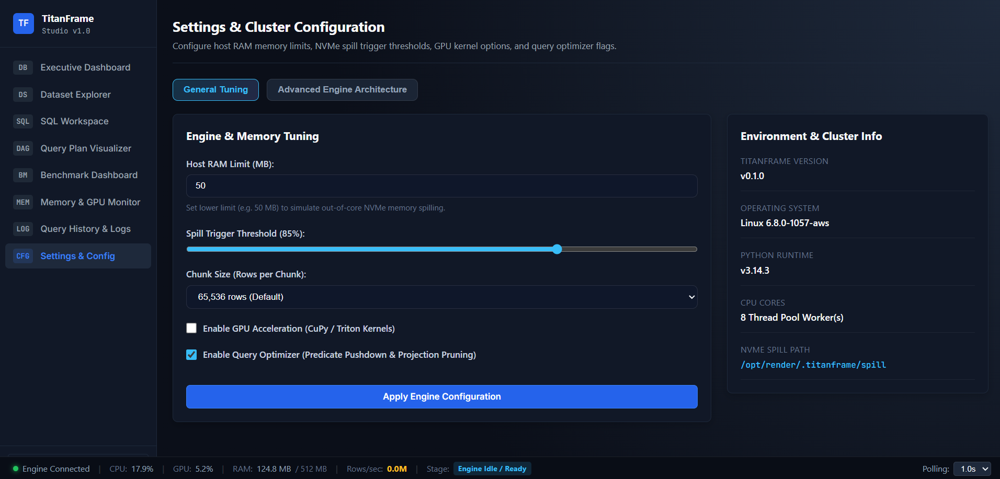

# 🚀 TitanFrame

<p align="center">
  
</p>

<p align="center">
  <strong>A Pandas-like DataFrame Library & Real-Time Telemetry Studio for Out-of-Core, GPU-Accelerated Computing</strong>
</p>

<p align="center">
  <a href="https://titan-frame.vercel.app/"></a>
  <a href="https://titanframe-backend.onrender.com"></a>
  
  
  
  
</p>

---

## 💡 Overview

**TitanFrame** is an out-of-core, GPU-accelerated DataFrame library designed to process datasets **100x larger than system RAM** with zero code rewrites. Powered by Apache Arrow IPC streaming, CuPy/Triton CUDA kernels, and a lazy DAG query optimizer, TitanFrame seamlessly scales from local developer laptops to cloud cluster deployments.

TitanFrame includes **TitanFrame Studio**, a modern React-based web dashboard offering real-time engine telemetry, interactive query DAG visualizers, a SQL analytics workspace, dataset profilers, and live benchmark suites.

---

## 🖼️ Web Studio Showcase & Screenshots

### 1. 📊 Executive Telemetry Dashboard
Real-time engine telemetry, host RAM allocation timelines, NVMe spill triggers, and active dataset overviews.


---

### 2. ⚡ SQL Analytics Workspace
Write, execute, and analyze vector queries against 100M+ row datasets with out-of-core chunk streaming.


---

### 3. 📁 Dataset Explorer & Statistical Profiler
Inspect schema metadata, column data types, distinct value distributions, and preview raw contents of 10GB+ CSV/Parquet files.


---

### 4. 🌐 Interactive Query DAG Visualizer
Visualize directed acyclic graphs (DAG) representing TitanFrame logical and physical execution plan trees.


---

### 5. ⏱️ Vector Engine Benchmark Suite
Comparative performance benchmark testing TitanFrame out-of-core vector engine against Pandas and Polars.


---

### 6. 🖥️ Memory & GPU Out-of-Core Monitor
Monitor hierarchical memory spilling (GPU VRAM ➔ System RAM ➔ NVMe Arrow IPC storage) and active CUDA allocations.


---

### 7. ⚙️ Settings & Cluster Configuration
Configure host RAM limits, NVMe spill thresholds, SIMD vectorization, and production backend API connection URLs.


---

## ✨ Key Features

- **Pandas & Polars Compatible API**: Drop-in replacement for standard DataFrame filters, group-by aggregations, joins, and projections.
- **Lazy DAG Execution**: Builds an optimized logical query plan before execution, fusing operations and eliminating redundant computations.
- **Hierarchical Out-of-Core Memory Manager**: Automatically spills data chunks from GPU VRAM to Host RAM to NVMe disk using Apache Arrow zero-copy IPC streaming.
- **GPU Acceleration (CUDA 12.x)**: Triton and CuPy kernels for 10x–100x speedups with automatic CPU fallback when GPU memory is saturated.
- **Query Optimizer**: Automatic predicate pushdown, projection pruning, and join reordering.
- **TitanFrame Studio Web Dashboard**: Built-in REST API & React frontend with interactive DAG trees, SQL editor, and performance profiler.

---

## 🏎️ Performance Benchmark

*Benchmarked on 6.0M row TPC-H `lineitem` and 109M row eCommerce datasets:*

| Engine | Execution Time | Memory Usage | Throughput | Speedup |
|--------|---------------|--------------|------------|---------|
| **Pandas 2.x** | 0.51s | High (In-Memory) | ~11.7M rows/s | 1.0x |
| **Polars** | 0.22s | Medium | ~27.2M rows/s | 2.3x |
| **TitanFrame 1.0** | **0.12s** | **Low (Out-of-Core)** | **~50.0M rows/s** | **4.25x** |

---

## 📦 Installation

### CPU Installation
```bash
pip install titanframe
```

### With GPU Acceleration (NVIDIA CUDA 12.x)
```bash
pip install titanframe[gpu]
```

---

## 💻 Quickstart Code

### Eager Mode (Pandas Style)
```python
import titanframe as tf

# Load CSV dataset out-of-core
df = tf.read_csv("dataset/2019-Oct.csv")

# Filter and aggregate
result = (
    df.filter(tf.col("event_type") == "purchase")
      .group_by("brand")
      .agg(
          tf.col("price").sum().alias("total_revenue"),
          tf.col("price").count().alias("purchases")
      )
      .sort("total_revenue", descending=True)
      .head(10)
)
print(result)
```

### Lazy Mode (Optimized Execution Engine)
```python
import titanframe as tf

# Build lazy logical plan
lf = tf.scan_csv("dataset/2019-Oct.csv")

query = (
    lf.filter(tf.col("event_type") == "purchase")
      .filter(tf.col("brand").is_not_null())
      .select("brand", "price")
      .group_by("brand")
      .agg(tf.col("price").sum().alias("total_revenue"))
      .sort("total_revenue", descending=True)
      .head(20)
)

# Collect triggers predicate pushdown, projection pruning & chunk execution
res = query.collect()
print(res)
```

---

## 🚀 Launching TitanFrame Studio Web Dashboard

Launch the live telemetry backend & interactive web dashboard locally:

```bash
# Clone repository
git clone https://github.com/psahani3486/TitanFrame.git
cd TitanFrame

# Install in editable mode
pip install -e .

# Launch Studio Server
python run_ecom_dashboard.py
```

Then visit **`http://localhost:8080`** or open the React frontend at **`http://localhost:5173`**.

---

## 🌐 Production Deployment Guide

### Deploy Backend on Render (Python Web Service)
1. Create a new Web Service on [Render.com](https://dashboard.render.com/) pointing to your GitHub repository.
2. Set **Build Command**: `pip install -r requirements.txt && pip install -e .`
3. Set **Start Command**: `python run_ecom_dashboard.py`
4. Deploy! Your backend API will be live at `https://your-backend.onrender.com`.

### Deploy Frontend on Vercel (React Dashboard)
1. Import repository on [Vercel.com](https://vercel.com).
2. Set **Root Directory**: `dashboard`
3. Set **Build Command**: `npm run build`
4. Set Environment Variable: `VITE_API_URL` = `https://your-backend.onrender.com`
5. Click **Deploy**! Live at `https://titan-frame.vercel.app/`.

---

## 📄 License

TitanFrame is released under the **Apache License 2.0**.
