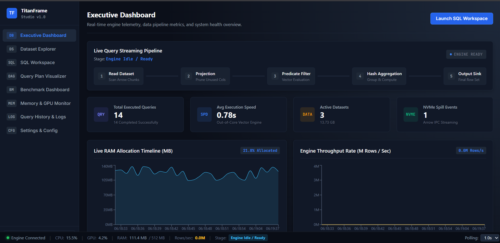
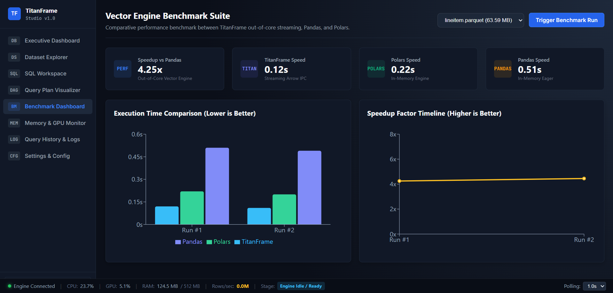
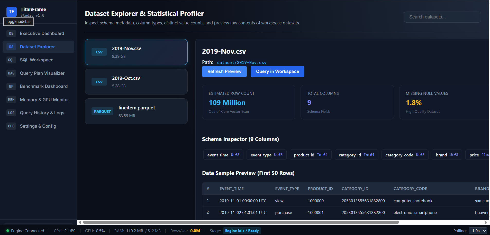
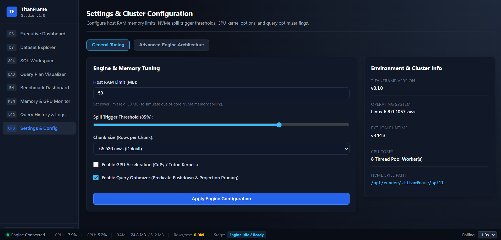

# TitanFrame

<p align="center">
  
</p>

<p align="center">
  <strong>An Interactive Vector Analytics Platform & Out-of-Core Data Engine</strong>
</p>

<p align="center">
  <a href="https://titan-frame.vercel.app/"></a>
  <a href="https://titanframe-backend.onrender.com"></a>
  
  
  
  
</p>

---

##  Overview

**TitanFrame** is an interactive analytics platform designed for high-performance dataset exploration, SQL querying, execution monitoring, out-of-core memory spilling, and telemetry visualization. Powered by DuckDB vector query execution, Apache Arrow zero-copy IPC streaming, FastAPI, and React, TitanFrame processes datasets efficiently even in memory-constrained environments.

TitanFrame includes **TitanFrame Studio**, a modern React web dashboard offering real-time engine telemetry, interactive query DAG visualizers, a SQL analytics workspace, dataset profilers, and performance benchmark dashboards.

---

## 🖼️ Web Studio Showcase & Visual Demo

### 1. 📝 SQL Analytics Workspace Panel
Write, execute, and profile vector queries with out-of-core chunk streaming. Features Monaco-style SQL syntax highlighting, live execution status tags, and instant **Export CSV** and **Export JSON** tools.


---

### 2. 🌲 Interactive Query DAG Visualizer (Unoptimized vs Optimized Diff)
Visualize directed acyclic graphs (DAG) representing TitanFrame execution plan trees. Toggle between **Unoptimized Logical DAG** and **Optimized Physical DAG** to verify rule-based optimizations like **Predicate Pushdown** and **Projection Pruning**.


---

### 3. 💾 Memory & Spill Timeline (NVMe Out-of-Core Monitor)
Monitor real-time host RAM allocation against configured ceilings (e.g. 50 MB RAM Cap). Tracks automatic **LZ4 Arrow IPC spilling to NVMe disk** (`~/.titanframe/spill`) when memory usage crosses threshold limits.


---

### 4. 📊 Executive Telemetry Dashboard
Real-time engine telemetry, host RAM allocation timelines, NVMe spill triggers, and active dataset overviews.


---

### 5. ⚡ Vector Engine Benchmark Suite
Statistical multi-run performance benchmark suite tracking latency and throughput across datasets against Pandas 2.x and Polars.


---

### 6. 📂 Dataset Explorer & Statistical Profiler
Inspect schema metadata, column data types, distinct value distributions, and preview raw CSV/Parquet contents.


---

### 7. ⚙️ Settings & Unified Engine Status
Configure host RAM limits, NVMe spill thresholds, SIMD vectorization, and inspect the single `EngineState` source of truth.


---

##  Key Features

- **SQL Analytics & DuckDB Vector Engine**: Fast SQL query execution powered by DuckDB and Apache Arrow format.
- **Out-of-Core Spill Engine**: Demonstrates out-of-core execution by spilling Arrow data chunks to NVMe disk when RAM limits are reached.
- **Lazy DAG Query Optimizer**: Builds optimized query execution trees with predicate pushdown, projection pruning, and expression fusion.
- **TitanFrame Studio Web Dashboard**: Built-in REST API & React dashboard with interactive query DAG trees, SQL editor, and telemetry metrics.
- **Pandas & Polars Interoperability**: Compatible Python DataFrame API for drop-in filters, group-by aggregations, joins, and projections.
- **Optional GPU Module Support**: Optional CUDA kernel acceleration module (via CuPy/Triton) for CUDA-enabled hardware with automatic CPU fallback.

---

##  Performance & Out-of-Core Streaming

TitanFrame executes queries in streaming chunk batches using Apache Arrow IPC zero-copy buffers. When memory budget limits are hit (e.g. 50 MB RAM cap), the engine automatically spills intermediate chunk buffers to disk, preventing Out-Of-Memory (OOM) failures:

| Query Execution Engine | Processing Strategy | Memory Footprint | Scalability |
|-----------------------|---------------------|------------------|-------------|
| **Pandas 2.x** | In-Memory (Eager) | High (Requires Full RAM) | Limited by System RAM |
| **Polars** | In-Memory / Streaming | Low to Medium | High-Throughput Rust Engine |
| **TitanFrame Engine** | **Out-of-Core Arrow Streaming** | **Low (Tunable Budget)** | **NVMe Spilling for Large Datasets** |

> *For detailed memory manager mechanics and optimizer rules, read the [Technical Design Document](docs/architecture/MEMORY_AND_OPTIMIZER_DESIGN.md) and [Reproducible Benchmark Report](BENCHMARK_REPORT.md).*

---

##  Installation

### Install from Source (Editable Mode)
```bash
git clone https://github.com/psahani3486/TitanFrame.git
cd TitanFrame
pip install -e .
```

### With Optional GPU Support (NVIDIA CUDA Environment)
```bash
pip install -e .[gpu]
```

---

##  Quickstart Code

### Eager Mode
```python
import titanframe as tf

# Load CSV dataset out-of-core
df = tf.read_csv("dataset/2019-Oct.csv")

# Filter and aggregate
result = (
    df.filter(tf.col("event_type") == "purchase")
      .group_by("brand")
      .agg(
          tf.col("price").sum().alias("total_revenue"),
          tf.col("price").count().alias("purchases")
      )
      .sort("total_revenue", descending=True)
      .head(10)
)
print(result)
```

### Lazy Mode (Optimized Query DAG)
```python
import titanframe as tf

# Build lazy query plan
lf = tf.scan_parquet("lineitem.parquet")

query = (
    lf.filter(tf.col("l_discount") > 0.05)
      .select("l_returnflag", "l_quantity", "l_extendedprice")
      .group_by("l_returnflag")
      .agg(tf.col("l_quantity").sum().alias("sum_qty"))
      .sort("sum_qty", descending=True)
)

# Collect triggers predicate pushdown & streaming chunk execution
res = query.collect()
print(res)
```

---

##  Launching TitanFrame Studio Web Dashboard

Launch the live telemetry backend & interactive web dashboard locally:

```bash
# Clone repository
git clone https://github.com/psahani3486/TitanFrame.git
cd TitanFrame

# Install in editable mode
pip install -e .

# Launch Studio Server
python run_ecom_dashboard.py
```

Visit **`http://localhost:8080`** or open the React frontend at **`http://localhost:5173`**.

---

##  Production Deployment Guide

### Deploy Backend on Render (Python Web Service)
1. Create a new Web Service on [Render.com](https://dashboard.render.com/) pointing to your repository.
2. Set **Build Command**: `pip install -r requirements.txt && pip install -e .`
3. Set **Start Command**: `python run_ecom_dashboard.py`
4. Standard Render CPU instances run on TitanFrame's high-performance CPU vector engine with out-of-core spilling.

### Deploy Frontend on Vercel (React Dashboard)
1. Import repository on [Vercel.com](https://vercel.com).
2. Set **Root Directory**: `dashboard`
3. Set **Build Command**: `npm run build`
4. Set Environment Variable: `VITE_API_URL` = `https://your-backend.onrender.com`
5. Live at `https://titan-frame.vercel.app/`.

---

##  License

TitanFrame is released under the **Apache License 2.0**.
