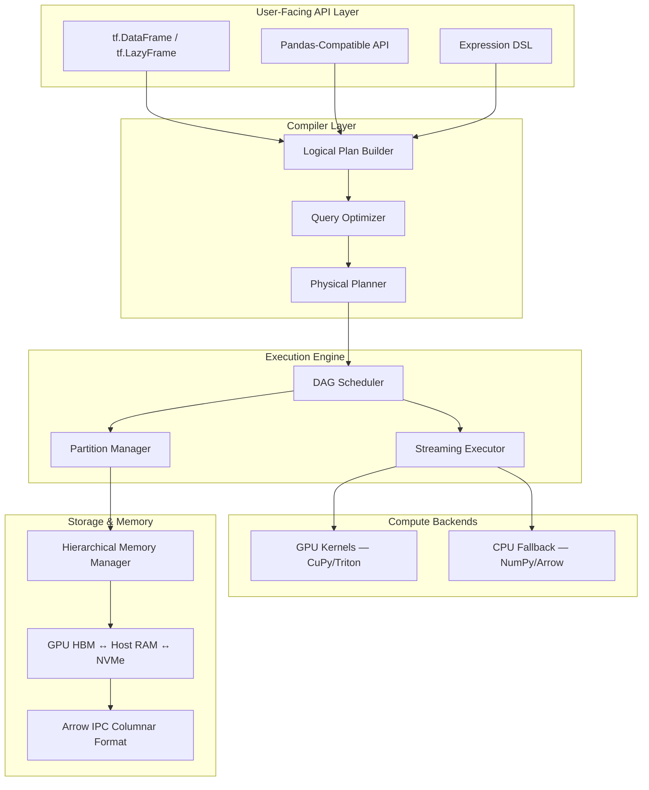
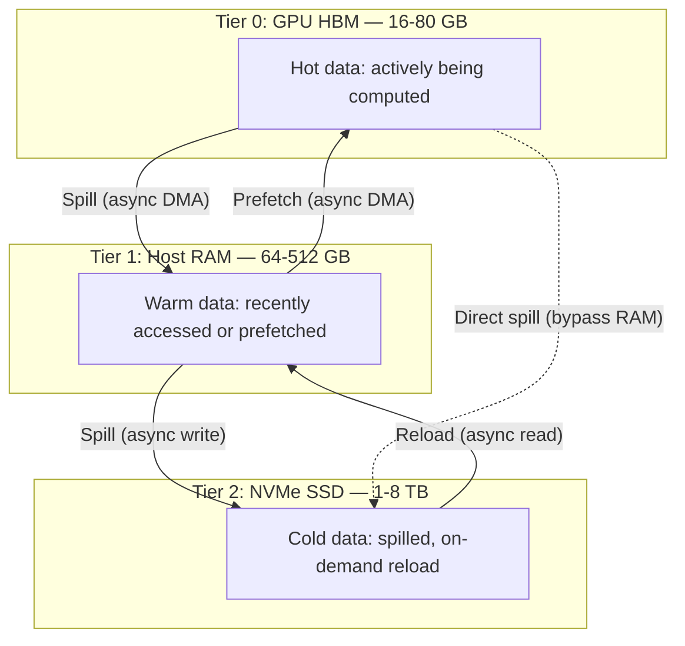
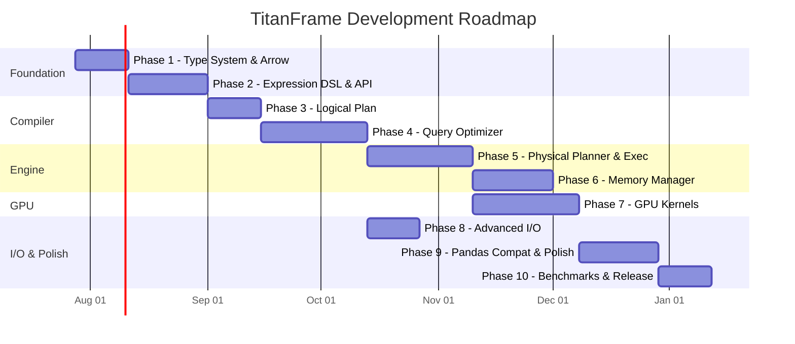

# TitanFrame: Pandas-Like DataFrame Library for Out-of-Core, GPU-Accelerated Computation

> A production-grade lazy execution engine with a Pandas-compatible API, capable of processing datasets 100x larger than RAM across multiple GPUs with automatic NVMe spilling.

## Architecture Overview



---

## Project Name: `titanframe`

### Directory Structure (Final)

```
titanframe/
├── pyproject.toml
├── README.md
├── LICENSE
├── benchmarks/
│   ├── __init__.py
│   ├── bench_filter.py
│   ├── bench_groupby.py
│   ├── bench_join.py
│   └── bench_io.py
├── docs/
│   ├── architecture.md
│   ├── api_reference.md
│   └── tutorials/
├── examples/
│   ├── quickstart.py
│   ├── gpu_analytics.py
│   └── out_of_core_etl.py
├── tests/
│   ├── __init__.py
│   ├── unit/
│   │   ├── test_dtype.py
│   │   ├── test_schema.py
│   │   ├── test_expression.py
│   │   ├── test_logical_plan.py
│   │   ├── test_optimizer.py
│   │   ├── test_physical_plan.py
│   │   ├── test_memory_manager.py
│   │   ├── test_gpu_kernels.py
│   │   └── test_io.py
│   ├── integration/
│   │   ├── test_end_to_end.py
│   │   ├── test_multi_gpu.py
│   │   └── test_spill.py
│   └── compatibility/
│       └── test_pandas_compat.py
├── titanframe/
│   ├── __init__.py
│   ├── _version.py
│   │
│   ├── core/                          # Phase 1–2
│   │   ├── __init__.py
│   │   ├── dtypes.py                  # Type system (Int8..Float64, Utf8, Bool, etc.)
│   │   ├── schema.py                  # Schema: ordered dict of column→dtype
│   │   ├── column.py                  # ChunkedColumn backed by Arrow arrays
│   │   ├── chunk.py                   # RecordBatch wrapper (Arrow IPC chunk)
│   │   └── table.py                   # Immutable columnar table (list of chunks)
│   │
│   ├── expr/                          # Phase 2
│   │   ├── __init__.py
│   │   ├── base.py                    # Expr ABC + operator overloads
│   │   ├── column_expr.py             # col("name")
│   │   ├── literal_expr.py            # lit(42)
│   │   ├── binary_expr.py             # Add, Sub, Mul, Div, And, Or, Gt, Lt…
│   │   ├── unary_expr.py              # Neg, Not, IsNull, IsNotNull
│   │   ├── agg_expr.py                # Sum, Mean, Min, Max, Count, Std, Var
│   │   ├── cast_expr.py               # cast(dtype)
│   │   ├── string_expr.py             # contains, startswith, replace, split…
│   │   ├── datetime_expr.py           # year, month, day, hour…
│   │   ├── window_expr.py             # over(), rank, row_number, lag, lead
│   │   └── udf_expr.py               # User-defined function wrapper
│   │
│   ├── plan/                          # Phase 3
│   │   ├── __init__.py
│   │   ├── logical/
│   │   │   ├── __init__.py
│   │   │   ├── node.py                # LogicalPlan base class
│   │   │   ├── scan.py                # Scan (CSV, Parquet, Arrow IPC, DB)
│   │   │   ├── projection.py          # Select / WithColumns
│   │   │   ├── filter.py              # Filter node
│   │   │   ├── aggregation.py         # GroupBy + Agg
│   │   │   ├── join.py                # Join (inner, left, right, outer, cross)
│   │   │   ├── sort.py                # Sort / OrderBy
│   │   │   ├── limit.py               # Head / Tail / Slice
│   │   │   ├── distinct.py            # Unique / DropDuplicates
│   │   │   ├── union.py               # VStack / Concat
│   │   │   └── sink.py                # Write targets (Parquet, CSV, Arrow)
│   │   │
│   │   ├── optimizer/                 # Phase 4
│   │   │   ├── __init__.py
│   │   │   ├── rule.py                # OptimizationRule ABC
│   │   │   ├── predicate_pushdown.py  # Push filters to scan
│   │   │   ├── projection_pushdown.py # Column pruning
│   │   │   ├── constant_folding.py    # Fold compile-time constants
│   │   │   ├── common_subexpr.py      # CSE elimination
│   │   │   ├── join_reorder.py        # Cost-based join ordering
│   │   │   ├── slice_pushdown.py      # Push LIMIT to scan
│   │   │   └── fusion.py             # Operator fusion (merge adjacent maps)
│   │   │
│   │   └── physical/                  # Phase 5
│   │       ├── __init__.py
│   │       ├── node.py                # PhysicalPlan base
│   │       ├── scan_exec.py           # Chunked file reader
│   │       ├── filter_exec.py         # Vectorized filter
│   │       ├── project_exec.py        # Column computation
│   │       ├── hash_agg_exec.py       # Hash-based aggregation
│   │       ├── sort_merge_exec.py     # External merge sort
│   │       ├── hash_join_exec.py      # Hash join implementation
│   │       ├── exchange_exec.py       # GPU↔CPU data exchange
│   │       └── sink_exec.py           # Output writer
│   │
│   ├── engine/                        # Phase 5–6
│   │   ├── __init__.py
│   │   ├── scheduler.py              # DAG-based task scheduler
│   │   ├── partition.py              # Data partitioning strategies
│   │   ├── pipeline.py               # Streaming pipeline executor
│   │   └── context.py                # Execution context (config, resources)
│   │
│   ├── memory/                        # Phase 6
│   │   ├── __init__.py
│   │   ├── manager.py                # Hierarchical memory manager
│   │   ├── pool.py                   # GPU memory pool (wraps RMM concepts)
│   │   ├── spill.py                  # Spill policy (HBM → RAM → NVMe)
│   │   ├── buffer.py                 # DeviceBuffer abstraction
│   │   └── tracker.py                # Memory usage tracker + telemetry
│   │
│   ├── gpu/                           # Phase 7
│   │   ├── __init__.py
│   │   ├── device.py                 # GPU device abstraction + multi-GPU
│   │   ├── transfer.py              # Host↔Device async transfer
│   │   ├── kernels/
│   │   │   ├── __init__.py
│   │   │   ├── elementwise.py        # CuPy elementwise ops
│   │   │   ├── reduction.py          # CuPy/Triton reductions
│   │   │   ├── filter.py             # Triton predicated scatter
│   │   │   ├── hash.py               # Triton hash table (for joins/groupby)
│   │   │   ├── sort.py               # GPU radix/merge sort
│   │   │   ├── string_ops.py         # GPU string processing
│   │   │   └── scan.py               # Parallel prefix scan
│   │   └── autotuner.py              # Kernel config autotuning
│   │
│   ├── io/                            # Phase 2, 8
│   │   ├── __init__.py
│   │   ├── csv.py                    # Chunked CSV reader/writer
│   │   ├── parquet.py                # Parquet reader/writer (predicate pushdown)
│   │   ├── arrow_ipc.py             # Arrow IPC (streaming + file format)
│   │   ├── json.py                   # JSON/NDJSON reader
│   │   └── database.py              # SQLAlchemy-based DB connector
│   │
│   └── api/                           # Phase 2, 9
│       ├── __init__.py
│       ├── dataframe.py              # DataFrame (eager) — Pandas-like API
│       ├── lazyframe.py              # LazyFrame — deferred execution
│       ├── series.py                 # Series (single column)
│       ├── groupby.py                # GroupBy proxy
│       ├── functions.py              # Top-level functions (concat, merge, etc.)
│       └── config.py                 # Global config (GPU device, memory limits)
```

---

## Phase 1: Foundation — Type System & Arrow Integration
**Duration: ~2 weeks** | **Complexity: Medium** | **Dependencies: None**

### Goal
Build the bedrock: a robust type system and zero-copy integration with Apache Arrow as the canonical in-memory columnar format.

### Key Design Decisions

> [!IMPORTANT]
> Arrow is chosen as the canonical format because it provides zero-copy interop with Pandas, Polars, cuDF, Spark, and DuckDB. Every buffer in TitanFrame is an Arrow buffer.

#### Files to Create

#### [NEW] [dtypes.py](file:///c:/Users/Pankaj/Downloads/New%20folder%20(10)/titanframe/core/dtypes.py)
- Enum-based type system: `Int8, Int16, Int32, Int64, UInt8..UInt64, Float32, Float64, Bool, Utf8, Binary, Date, Datetime, Duration, Null, List, Struct`
- Each dtype knows its Arrow equivalent, numpy dtype, byte-width, and nullability
- Type promotion rules matrix (e.g., `Int32 + Float64 → Float64`)
- `can_cast(from_dtype, to_dtype) → bool` with safe/unsafe modes

#### [NEW] [schema.py](file:///c:/Users/Pankaj/Downloads/New%20folder%20(10)/titanframe/core/schema.py)
- `Schema`: ordered mapping of `column_name → DType`
- Schema algebra: `merge()`, `intersect()`, `diff()`, `rename()`
- Schema validation and compatibility checking for joins/unions

#### [NEW] [chunk.py](file:///c:/Users/Pankaj/Downloads/New%20folder%20(10)/titanframe/core/chunk.py)
- `Chunk`: thin wrapper around `pyarrow.RecordBatch`
- Tracks device location (`CPU`, `GPU_0`, `GPU_1`, `NVME`)
- Lazy deserialization: metadata parsed eagerly, data materialized on demand
- Methods: `to_arrow()`, `from_arrow()`, `num_rows`, `num_bytes`, `slice(offset, length)`

#### [NEW] [column.py](file:///c:/Users/Pankaj/Downloads/New%20folder%20(10)/titanframe/core/column.py)
- `ChunkedColumn`: list of Arrow arrays representing a single column across chunks
- Supports null bitmap tracking
- Methods: `append_chunk()`, `rechunk()`, `to_pyarrow()`, `null_count`, `nbytes`

#### [NEW] [table.py](file:///c:/Users/Pankaj/Downloads/New%20folder%20(10)/titanframe/core/table.py)
- `Table`: immutable collection of `Chunk` objects with a unified `Schema`
- Core operations: column selection, row slicing, concatenation
- Memory-mapped construction from Arrow IPC files

### Verification
- Unit tests for dtype promotion matrix (all 20×20 combinations)
- Round-trip test: Python dict → Table → Arrow → Table → Python dict
- Benchmark: Arrow IPC read speed vs raw `pyarrow` (must be within 5%)

---

## Phase 2: Expression DSL & API Surface
**Duration: ~3 weeks** | **Complexity: High** | **Dependencies: Phase 1**

### Goal
Build the expression tree system that captures user intent without executing it, and the user-facing `DataFrame`/`LazyFrame` API that feels like Pandas.

### Key Design Decisions

> [!IMPORTANT]
> Every operation on a `LazyFrame` returns a new `LazyFrame` with an updated logical plan — no mutation, no side effects. The `collect()` call is the only trigger for execution. The eager `DataFrame` API is syntactic sugar that calls `collect()` after every operation.

#### Expression System

#### [NEW] [base.py](file:///c:/Users/Pankaj/Downloads/New%20folder%20(10)/titanframe/expr/base.py)
```python
class Expr:
    """Base expression node. All operators build a tree."""
    def __add__(self, other): return BinaryExpr(Op.ADD, self, _wrap(other))
    def __gt__(self, other):  return BinaryExpr(Op.GT, self, _wrap(other))
    def alias(self, name):   return AliasExpr(self, name)
    def cast(self, dtype):   return CastExpr(self, dtype)
    def sum(self):           return AggExpr(AggOp.SUM, self)
    def mean(self):          return AggExpr(AggOp.MEAN, self)
    # ... 50+ methods mirroring Pandas Series API
```

#### [NEW] [column_expr.py](file:///c:/Users/Pankaj/Downloads/New%20folder%20(10)/titanframe/expr/column_expr.py)
- `col("name")` → `ColumnExpr("name")` — references a column by name
- `col("*")` → selects all columns (wildcard expansion during planning)

#### [NEW] [literal_expr.py](file:///c:/Users/Pankaj/Downloads/New%20folder%20(10)/titanframe/expr/literal_expr.py)
- `lit(42)` → `LiteralExpr(42, Int64)` — auto-inferred dtype from Python type

#### [NEW] [binary_expr.py](file:///c:/Users/Pankaj/Downloads/New%20folder%20(10)/titanframe/expr/binary_expr.py)
- All arithmetic: `Add, Sub, Mul, TrueDiv, FloorDiv, Mod, Pow`
- All comparison: `Eq, Ne, Lt, Le, Gt, Ge`
- All logical: `And, Or, Xor`

#### [NEW] [agg_expr.py](file:///c:/Users/Pankaj/Downloads/New%20folder%20(10)/titanframe/expr/agg_expr.py)
- `Sum, Mean, Min, Max, Count, CountDistinct, First, Last, Std, Var, Median, Quantile`
- Partial aggregation support: `partial_agg() → merge_agg()` for distributed execution

#### User-Facing API

#### [NEW] [dataframe.py](file:///c:/Users/Pankaj/Downloads/New%20folder%20(10)/titanframe/api/dataframe.py)
```python
class DataFrame:
    """Eager DataFrame — Pandas-compatible API."""
    
    def select(self, *exprs) -> 'DataFrame': ...
    def filter(self, expr) -> 'DataFrame': ...
    def with_columns(self, *exprs) -> 'DataFrame': ...
    def group_by(self, *keys) -> 'GroupBy': ...
    def join(self, other, on, how='inner') -> 'DataFrame': ...
    def sort(self, by, descending=False) -> 'DataFrame': ...
    def head(self, n=5) -> 'DataFrame': ...
    def describe(self) -> 'DataFrame': ...
    def to_pandas(self) -> pd.DataFrame: ...
    
    # Pandas aliases
    def __getitem__(self, key): ...          # df["col"] or df[mask]
    def __setitem__(self, key, value): ...   # df["new_col"] = expr
    def loc(self): ...                       # Label-based indexing
    def iloc(self): ...                      # Integer-based indexing
```

#### [NEW] [lazyframe.py](file:///c:/Users/Pankaj/Downloads/New%20folder%20(10)/titanframe/api/lazyframe.py)
```python
class LazyFrame:
    """Deferred execution — builds a logical plan."""
    
    def __init__(self, plan: LogicalPlan): ...
    def select(self, *exprs) -> 'LazyFrame': ...
    def filter(self, expr) -> 'LazyFrame': ...
    def group_by(self, *keys) -> 'LazyGroupBy': ...
    def join(self, other, on, how='inner') -> 'LazyFrame': ...
    def sort(self, by) -> 'LazyFrame': ...
    def collect(self) -> DataFrame: ...     # ← TRIGGERS EXECUTION
    def explain(self) -> str: ...           # Print optimized plan
    def show_graph(self) -> None: ...       # Visualize DAG
```

#### [NEW] Basic I/O — [csv.py](file:///c:/Users/Pankaj/Downloads/New%20folder%20(10)/titanframe/io/csv.py) & [arrow_ipc.py](file:///c:/Users/Pankaj/Downloads/New%20folder%20(10)/titanframe/io/arrow_ipc.py)
- `tf.read_csv(path, chunk_size=...)` → eager or lazy scan
- `tf.scan_csv(path)` → LazyFrame (deferred read)
- Arrow IPC streaming read/write for internal spill format

### Verification
- Test expression tree serialization: `(col("a") + 1) > col("b")` produces correct AST
- Pandas compatibility test: run 50 common Pandas operations and compare output
- Type inference test: verify expression output dtypes match expectations

---

## Phase 3: Logical Plan — The Computation Graph
**Duration: ~2 weeks** | **Complexity: High** | **Dependencies: Phase 2**

### Goal
Build the DAG-based logical plan that captures the complete computation as a directed acyclic graph of relational algebra operators.

### Key Design Decisions

> [!IMPORTANT]
> The logical plan is purely declarative — it describes *what* to compute, not *how*. Each node is immutable. Plans are manipulated via tree-rewriting rules in the optimizer.

#### Plan Nodes

#### [NEW] [node.py](file:///c:/Users/Pankaj/Downloads/New%20folder%20(10)/titanframe/plan/logical/node.py)
```python
class LogicalPlan:
    """Base class for all logical plan nodes."""
    children: List[LogicalPlan]      # Input plan(s)
    schema: Schema                   # Output schema of this node
    
    def accept(self, visitor): ...   # Visitor pattern for traversal
    def map_children(self, fn): ...  # Functional tree rewriting
    def display(self, indent=0): ... # Pretty-print the plan tree
```

#### All Logical Nodes (one file each):

| Node | File | Description |
|------|------|-------------|
| `Scan` | `scan.py` | Read from source (CSV, Parquet, IPC, DB). Stores path, schema, optional predicate, optional projection |
| `Projection` | `projection.py` | `SELECT expr1, expr2, ...` — maps expressions over input |
| `Filter` | `filter.py` | `WHERE predicate` — boolean mask filtering |
| `Aggregation` | `aggregation.py` | `GROUP BY keys AGG(values)` — grouping + aggregation |
| `Join` | `join.py` | Relational join with configurable strategy |
| `Sort` | `sort.py` | `ORDER BY` with multi-key support |
| `Limit` | `limit.py` | `LIMIT n` / `OFFSET m` |
| `Distinct` | `distinct.py` | `DISTINCT` / deduplication |
| `Union` | `union.py` | Vertical concatenation |
| `Sink` | `sink.py` | Write to target (Parquet, CSV, etc.) |

#### Plan Builder
The `LazyFrame` methods (`select`, `filter`, etc.) each append a new `LogicalPlan` node on top of the current plan, building the tree from bottom (scan) to top (output).

### Verification
- Build a complex plan (scan → filter → join → groupby → sort → limit) and verify the tree structure
- Schema propagation test: each node correctly infers its output schema
- Plan equivalence test: two semantically equivalent plans produce the same logical tree

---

## Phase 4: Query Optimizer — The Compiler
**Duration: ~4 weeks** | **Complexity: Very High** | **Dependencies: Phase 3**

### Goal
Build a rule-based query optimizer that rewrites logical plans for maximum performance. This is the *compiler* of the system.

### Key Design Decisions

> [!WARNING]
> The optimizer must be **idempotent** — applying rules repeatedly produces the same result. Rules are applied in multiple passes until convergence (fixed-point iteration).

#### Optimization Rules

#### [NEW] [rule.py](file:///c:/Users/Pankaj/Downloads/New%20folder%20(10)/titanframe/plan/optimizer/rule.py)
```python
class OptimizationRule(ABC):
    """A single rewrite rule applied to the logical plan."""
    
    @abstractmethod
    def apply(self, plan: LogicalPlan) -> LogicalPlan:
        """Return a rewritten plan, or the same plan if the rule doesn't apply."""
    
    @property
    def name(self) -> str: ...
```

The optimizer applies rules in this order:


| Rule | File | What it does |
|------|------|-------------|
| Predicate Pushdown | `predicate_pushdown.py` | Moves `Filter` nodes below `Join`, `Projection`, toward `Scan`. For Parquet, embeds predicates in the scan node for row-group skipping |
| Projection Pushdown | `projection_pushdown.py` | Traces column references upward; prunes unused columns at scan. Reduces I/O by 10–100x on wide tables |
| Constant Folding | `constant_folding.py` | Evaluates `lit(2) + lit(3)` → `lit(5)` at compile time |
| Common Subexpr Elimination | `common_subexpr.py` | Detects duplicate subtrees and replaces with a single computation + reference |
| Join Reordering | `join_reorder.py` | Cost-based: reorders joins to put the smallest table on the build side of hash joins |
| Slice Pushdown | `slice_pushdown.py` | Pushes `LIMIT` into scans to avoid reading entire files |
| Operator Fusion | `fusion.py` | Merges adjacent `Projection → Projection` and `Filter → Filter` into single nodes |

#### Optimizer Driver

```python
class QueryOptimizer:
    rules: List[OptimizationRule]
    max_passes: int = 10
    
    def optimize(self, plan: LogicalPlan) -> LogicalPlan:
        for _ in range(self.max_passes):
            new_plan = plan
            for rule in self.rules:
                new_plan = rule.apply(new_plan)
            if new_plan == plan:  # Fixed point reached
                break
            plan = new_plan
        return plan
```

### Verification
- **Predicate pushdown test**: `scan("file").select(…).filter(x > 10)` → filter is embedded in scan node
- **Projection pushdown test**: 100-column table, `select(col("a"), col("b"))` → scan only reads 2 columns
- **Plan comparison**: `explain()` output for optimized vs unoptimized plans
- **Correctness**: Optimized plan produces identical results to unoptimized plan on test datasets

---

## Phase 5: Physical Planner & Execution Engine
**Duration: ~4 weeks** | **Complexity: Very High** | **Dependencies: Phase 4**

### Goal
Convert the optimized logical plan into a physical execution plan with concrete algorithms, then execute it using a streaming, partitioned pipeline.

### Key Design Decisions

> [!IMPORTANT]
> The execution engine uses a **volcano/pull-based iterator model** combined with **vectorized batch processing**. Each physical operator processes data one `Chunk` (Arrow RecordBatch) at a time, enabling streaming execution that never requires the full dataset in memory.

#### Physical Plan Nodes

#### [NEW] [node.py](file:///c:/Users/Pankaj/Downloads/New%20folder%20(10)/titanframe/plan/physical/node.py)
```python
class PhysicalPlan:
    """Base class for executable plan nodes."""
    
    def execute(self, context: ExecutionContext) -> Iterator[Chunk]:
        """Pull-based: yields output chunks one at a time."""
        raise NotImplementedError
    
    def estimated_rows(self) -> int: ...
    def estimated_bytes(self) -> int: ...
    def device_preference(self) -> Device: ...  # CPU or GPU
```

| Physical Node | File | Algorithm |
|--------------|------|-----------|
| `ScanExec` | `scan_exec.py` | Chunked file reader with configurable batch size (default 64K rows). Applies pushed-down predicates and projections at read time |
| `FilterExec` | `filter_exec.py` | Vectorized boolean mask evaluation → `pyarrow.compute.filter` (CPU) or CuPy boolean indexing (GPU) |
| `ProjectExec` | `project_exec.py` | Expression evaluator: walks the expression tree and computes each chunk |
| `HashAggExec` | `hash_agg_exec.py` | Two-phase: (1) partial aggregation per chunk → hash table, (2) merge all partials. Spill-aware |
| `SortMergeExec` | `sort_merge_exec.py` | External merge sort: sort each chunk in GPU memory, spill sorted runs to NVMe, k-way merge |
| `HashJoinExec` | `hash_join_exec.py` | Build hash table from smaller side, probe with larger side. Partitioned for multi-GPU |
| `ExchangeExec` | `exchange_exec.py` | Data repartitioning across GPUs (hash, round-robin, range) |
| `SinkExec` | `sink_exec.py` | Streaming writer to Parquet/CSV/Arrow IPC |

#### Expression Evaluator (inside ProjectExec)
```python
class ExprEvaluator:
    """Walks an Expr tree and computes results on a Chunk."""
    
    def eval(self, expr: Expr, chunk: Chunk) -> pa.Array:
        match expr:
            case ColumnExpr(name):
                return chunk.column(name)
            case LiteralExpr(value, dtype):
                return pa.array([value] * chunk.num_rows, type=dtype.to_arrow())
            case BinaryExpr(op, left, right):
                l = self.eval(left, chunk)
                r = self.eval(right, chunk)
                return self._apply_binary(op, l, r)
            case AggExpr(op, child):
                return self._apply_agg(op, self.eval(child, chunk))
```

#### DAG Scheduler

#### [NEW] [scheduler.py](file:///c:/Users/Pankaj/Downloads/New%20folder%20(10)/titanframe/engine/scheduler.py)
```python
class DAGScheduler:
    """Schedules physical plan execution across partitions and devices."""
    
    def execute(self, plan: PhysicalPlan, ctx: ExecutionContext) -> Table:
        # 1. Partition input data into chunks
        # 2. Build task graph from physical plan
        # 3. Topological sort → execution order
        # 4. Execute tasks with thread pool (CPU) or stream pool (GPU)
        # 5. Respect memory budget; trigger spills when needed
        ...
```

#### Streaming Pipeline

#### [NEW] [pipeline.py](file:///c:/Users/Pankaj/Downloads/New%20folder%20(10)/titanframe/engine/pipeline.py)
- Chains physical operators into a streaming pipeline
- Double-buffered: while chunk N is being processed, chunk N+1 is being loaded
- Backpressure: if downstream is slow, upstream pauses (bounded queue)

### Verification
- End-to-end test: `scan_csv("10M_rows.csv").filter(...).group_by(...).agg(...).collect()` produces correct results
- Streaming test: process a 10GB file with only 512MB memory budget
- Algorithm test: hash join correctness against Pandas `merge()` for all join types

---

## Phase 6: Hierarchical Memory Manager
**Duration: ~3 weeks** | **Complexity: Very High** | **Dependencies: Phase 5**

### Goal
Build a three-tier memory manager that seamlessly moves data between GPU HBM, host RAM, and NVMe storage based on access patterns and pressure.

### Key Design Decisions

> [!CAUTION]
> This is the most systems-critical component. Incorrect spill logic can cause data loss, deadlocks (circular spill dependencies), or catastrophic performance degradation. The manager must be **lock-free on the hot path** and **thread-safe everywhere**.

#### Memory Hierarchy



#### Key Files

#### [NEW] [manager.py](file:///c:/Users/Pankaj/Downloads/New%20folder%20(10)/titanframe/memory/manager.py)
```python
class MemoryManager:
    """Hierarchical memory manager with automatic spilling."""
    
    tiers: Dict[Tier, MemoryPool]   # GPU, RAM, NVMe
    budget: Dict[Tier, int]          # Max bytes per tier
    policy: SpillPolicy              # LRU, LFU, or access-pattern-aware
    
    def allocate(self, nbytes: int, tier: Tier) -> Buffer: ...
    def spill(self, buffer: Buffer, target_tier: Tier) -> None: ...
    def prefetch(self, buffer: Buffer, target_tier: Tier) -> Future: ...
    def pressure(self, tier: Tier) -> float: ...  # 0.0–1.0
    def register_access(self, buffer: Buffer) -> None: ...
```

#### [NEW] [spill.py](file:///c:/Users/Pankaj/Downloads/New%20folder%20(10)/titanframe/memory/spill.py)
- **Spill Policy**: LRU with access-frequency weighting
- **Spill Trigger**: when any tier exceeds 85% capacity
- **Spill Format**: Arrow IPC (streaming) for fast serialization/deserialization
- **Async Spill**: uses CUDA async memcpy (GPU→RAM) and `io_uring`/`aiofiles` (RAM→NVMe)
- **Anti-thrash**: minimum residency time before a buffer can be re-spilled

#### [NEW] [buffer.py](file:///c:/Users/Pankaj/Downloads/New%20folder%20(10)/titanframe/memory/buffer.py)
```python
class DeviceBuffer:
    """A reference-counted buffer that tracks its location in the hierarchy."""
    
    data: Union[pa.Buffer, cp.ndarray, Path]  # Arrow, CuPy, or file path
    tier: Tier                                  # Current location
    pinned: bool                               # Cannot be spilled
    ref_count: int                             # Reference counting for GC
    access_count: int                          # For LFU policy
    last_access: float                         # For LRU policy
    size_bytes: int
    
    def to_tier(self, target: Tier) -> 'DeviceBuffer': ...
    def pin(self) -> None: ...
    def unpin(self) -> None: ...
```

#### [NEW] [tracker.py](file:///c:/Users/Pankaj/Downloads/New%20folder%20(10)/titanframe/memory/tracker.py)
- Real-time memory telemetry: bytes allocated/freed per tier
- Spill event logging with latency metrics
- Integration with Python `logging` and optional Prometheus export

### Verification
- **Stress test**: allocate 4x GPU memory worth of buffers, verify spill cascade works without OOM
- **Correctness**: spilled and reloaded data matches original byte-for-byte
- **Performance**: spill throughput ≥ 80% of raw NVMe sequential write bandwidth
- **Deadlock test**: concurrent allocations across threads never deadlock

---

## Phase 7: GPU Kernel Development
**Duration: ~4 weeks** | **Complexity: Extreme** | **Dependencies: Phase 5, 6**

### Goal
Implement high-performance GPU kernels for all core DataFrame operations using CuPy for standard ops and Triton for custom, fused kernels.

### Key Design Decisions

> [!IMPORTANT]
> **Strategy**: Use CuPy for operations that map cleanly to existing GPU primitives (elementwise, reductions, sorts). Use Triton for operations that benefit from kernel fusion or have no existing GPU implementation (hash tables, string ops, custom aggregations).

#### Kernel Inventory

#### [NEW] [elementwise.py](file:///c:/Users/Pankaj/Downloads/New%20folder%20(10)/titanframe/gpu/kernels/elementwise.py)
- **Backend**: CuPy `ElementwiseKernel`
- Arithmetic: `add, sub, mul, div, mod, pow` (all dtypes, with null propagation)
- Comparison: `eq, ne, lt, le, gt, ge`
- Logical: `and, or, xor, not`
- Unary: `abs, neg, ceil, floor, sqrt, log, exp`
- Null handling: null + anything = null (three-valued logic)

#### [NEW] [reduction.py](file:///c:/Users/Pankaj/Downloads/New%20folder%20(10)/titanframe/gpu/kernels/reduction.py)
- **Backend**: CuPy `ReductionKernel` + Triton for fused multi-column reductions
- `sum, mean, min, max, count, count_null, any, all`
- `std, var` — two-pass (stable) or Welford's online algorithm
- `quantile, median` — uses GPU sort + indexing

#### [NEW] [filter.py](file:///c:/Users/Pankaj/Downloads/New%20folder%20(10)/titanframe/gpu/kernels/filter.py)
- **Backend**: Triton
- Predicated scatter: apply boolean mask and compact output
- Uses parallel prefix scan to compute output indices
- Handles variable-width data (strings) via offset arrays

#### [NEW] [hash.py](file:///c:/Users/Pankaj/Downloads/New%20folder%20(10)/titanframe/gpu/kernels/hash.py)
- **Backend**: Triton
- Open-addressing hash table with linear probing
- Used by both `group_by` and `join` operations
- Composite key hashing: MurmurHash3 for integers, CityHash for strings
- Handles hash table resize with cooperative thread groups

#### [NEW] [sort.py](file:///c:/Users/Pankaj/Downloads/New%20folder%20(10)/titanframe/gpu/kernels/sort.py)
- **Backend**: CuPy (wraps CUB/Thrust)
- Radix sort for integer/float keys
- Merge sort for composite keys
- External sort integration: sort chunks on GPU, merge on CPU

#### [NEW] [string_ops.py](file:///c:/Users/Pankaj/Downloads/New%20folder%20(10)/titanframe/gpu/kernels/string_ops.py)
- **Backend**: Triton
- UTF-8 aware: `length, contains, starts_with, ends_with, replace, split, strip, upper, lower`
- Operates on Arrow StringArray (offsets + data buffer)

#### Multi-GPU Device Manager

#### [NEW] [device.py](file:///c:/Users/Pankaj/Downloads/New%20folder%20(10)/titanframe/gpu/device.py)
```python
class DeviceManager:
    """Manages multiple GPUs and data placement."""
    
    devices: List[GPUDevice]
    
    def select_device(self, nbytes: int) -> GPUDevice: ...  # Least-loaded
    def transfer(self, buffer, src, dst) -> Future: ...      # Async P2P
    def all_reduce(self, buffers, op) -> Buffer: ...         # NCCL
```

#### [NEW] [autotuner.py](file:///c:/Users/Pankaj/Downloads/New%20folder%20(10)/titanframe/gpu/autotuner.py)
- Wraps Triton's `@triton.autotune` with persistent caching
- Tunes `BLOCK_SIZE`, `num_warps`, `num_stages` per kernel per GPU architecture
- Cache invalidation on driver/hardware change

### Verification
- **Correctness**: every GPU kernel output matches `pyarrow.compute` / `numpy` reference
- **Performance**: elementwise ops ≥ 100 GB/s on A100, reductions ≥ 50 GB/s
- **Null handling**: extensive tests with 0%, 50%, 99% null ratios
- **Multi-GPU**: hash join across 2+ GPUs produces correct results

---

## Phase 8: Advanced I/O & File Formats
**Duration: ~2 weeks** | **Complexity: Medium** | **Dependencies: Phase 4, 5**

### Goal
Production-grade I/O with predicate pushdown, projection pushdown, and parallel reads.

#### Files

#### [NEW] [parquet.py](file:///c:/Users/Pankaj/Downloads/New%20folder%20(10)/titanframe/io/parquet.py)
- **Read**: columnar projection pushdown (read only needed columns), row-group filtering via statistics, parallel row-group reads
- **Write**: chunked streaming write, configurable compression (Snappy, ZSTD, LZ4), row-group size tuning
- Direct GPU decode path: Parquet → GPU buffer (skip CPU hop when possible)

#### [NEW] [json.py](file:///c:/Users/Pankaj/Downloads/New%20folder%20(10)/titanframe/io/json.py)
- NDJSON streaming reader
- Schema inference from first N records

#### [NEW] [database.py](file:///c:/Users/Pankaj/Downloads/New%20folder%20(10)/titanframe/io/database.py)
- SQLAlchemy-based connector
- Pushes WHERE/SELECT into SQL query
- Arrow-native result set consumption via ADBC

### Verification
- Round-trip test: DataFrame → Parquet → DataFrame (exact match including nulls)
- Predicate pushdown benchmark: filtered read should be 10x+ faster than full scan + filter
- Large file test: read 50GB Parquet file with 256MB memory budget

---

## Phase 9: Pandas Compatibility Layer & Polish
**Duration: ~3 weeks** | **Complexity: Medium** | **Dependencies: All previous phases**

### Goal
Ensure seamless Pandas drop-in compatibility and production-grade polish.

#### Pandas Compatibility

#### [MODIFY] [dataframe.py](file:///c:/Users/Pankaj/Downloads/New%20folder%20(10)/titanframe/api/dataframe.py)
- Implement remaining Pandas API surface:
  - `df.apply()`, `df.map()`, `df.applymap()`
  - `df.fillna()`, `df.dropna()`, `df.interpolate()`
  - `df.pivot_table()`, `df.melt()`, `df.stack()`, `df.unstack()`
  - `df.rolling()`, `df.expanding()`, `df.ewm()`
  - `df.merge()`, `df.concat()`, `df.append()`
  - `df.to_csv()`, `df.to_parquet()`, `df.to_json()`
  - `df.plot()` (delegates to matplotlib/plotly)
  - String accessor: `df["col"].str.contains(…)`
  - Datetime accessor: `df["col"].dt.year`

#### [NEW] [test_pandas_compat.py](file:///c:/Users/Pankaj/Downloads/New%20folder%20(10)/tests/compatibility/test_pandas_compat.py)
- Automated compatibility suite: run 200+ Pandas operations side-by-side and compare results
- Edge cases: empty DataFrames, all-null columns, mixed types, unicode strings

#### Production Polish
- `__repr__` for DataFrame/LazyFrame — rich table display in terminals and Jupyter
- Progress bars for long-running operations (via `tqdm`)
- Comprehensive error messages with suggested fixes
- Type stubs (`.pyi` files) for IDE autocomplete
- Sphinx documentation with runnable examples

### Verification
- Pandas compatibility score: ≥ 90% of common operations produce identical output
- Jupyter notebook demo: end-to-end analytics pipeline
- Performance benchmark suite vs Pandas, Polars, cuDF on TPC-H queries

---

## Phase 10: Benchmarking, Documentation & Open-Source Release
**Duration: ~2 weeks** | **Complexity: Medium** | **Dependencies: All previous phases**

### Goal
Prove the system works at scale with rigorous benchmarks and prepare for open-source release.

#### Benchmarks

#### [NEW] benchmarks/ directory
- **TPC-H** queries 1–22 at scale factor 10 and 100
- **Comparison matrix**: TitanFrame vs Pandas vs Polars vs cuDF vs Dask
- **Out-of-core test**: process 1TB dataset with 16GB RAM + 1x A100 (80GB)
- **Multi-GPU scaling**: 1, 2, 4, 8 GPUs on the same queries
- Automated benchmark runner with results published to a dashboard

#### Documentation

| Document | Content |
|----------|---------|
| `README.md` | Project overview, quickstart, badges |
| `docs/architecture.md` | System architecture deep-dive with diagrams |
| `docs/api_reference.md` | Auto-generated from docstrings |
| `docs/tutorials/` | Beginner, intermediate, advanced tutorials |
| `CONTRIBUTING.md` | How to contribute, code style, PR process |
| `CHANGELOG.md` | Version history |

#### Open-Source Preparation
- CI/CD: GitHub Actions for lint, test, benchmark on every PR
- Pre-commit hooks: black, ruff, mypy
- Package publishing: PyPI via `pyproject.toml`
- License: Apache 2.0

---

## Phase Summary & Timeline



> [!NOTE]
> **Total estimated timeline: ~6 months** for a solo developer working full-time. Phases 6 and 7 can run in parallel with Phase 5 since they are independent. Phase 8 can start after Phase 4.

---

## Technology Stack

| Layer | Technology | Rationale |
|-------|-----------|-----------|
| Language | Python 3.11+ | Target audience, ecosystem |
| Columnar Format | Apache Arrow / PyArrow | Industry standard, zero-copy |
| GPU Compute | CuPy | NumPy-compatible GPU arrays |
| Custom Kernels | Triton | Pythonic GPU kernels, auto-tuning |
| Memory Pool | Custom (inspired by RMM) | Hierarchical spill management |
| NVMe I/O | `aiofiles` / `io_uring` | Async spill to SSD |
| Serialization | Arrow IPC (streaming) | Fast spill/reload format |
| File Formats | Parquet, CSV, JSON | Standard data formats |
| Testing | pytest + hypothesis | Property-based testing |
| Benchmarks | `pytest-benchmark` | Reproducible perf tracking |
| Typing | mypy strict mode | Catch bugs at dev time |
| Docs | Sphinx + MyST | Markdown-based docs |

---

## Open Questions

> [!IMPORTANT]
> **Q1**: Should we target **CUDA-only** (NVIDIA GPUs) or also support **ROCm** (AMD GPUs) from the start? Supporting both doubles the GPU kernel testing surface but broadens the market. CuPy supports ROCm, but Triton's ROCm support is still maturing.

> [!IMPORTANT]
> **Q2**: Should the eager `DataFrame` API be **fully Pandas-compatible** (including `loc`/`iloc` label-based indexing) or follow the **Polars philosophy** of a cleaner API that breaks from Pandas conventions where they're inefficient? Full Pandas compat is more work but easier adoption.

> [!IMPORTANT]
> **Q3**: For the NVMe spill layer, should we use **Python-level async I/O** (`aiofiles`) or build a **C extension** wrapping `io_uring` directly? The C extension would be 2-5x faster for spill-heavy workloads but adds build complexity.

> [!IMPORTANT]
> **Q4**: What is the target **minimum GPU**? If we target Ampere+ (A100, RTX 3090), we can use newer features like async copy, tensor cores for certain reductions. If we target Turing (T4, RTX 2080), we have broader compatibility but fewer hardware features.

> [!WARNING]
> **Q5**: Do you want a **web-based dashboard** for monitoring memory usage, spill events, and query execution progress in real-time? This would add ~2 weeks but is extremely valuable for debugging out-of-core workloads.
